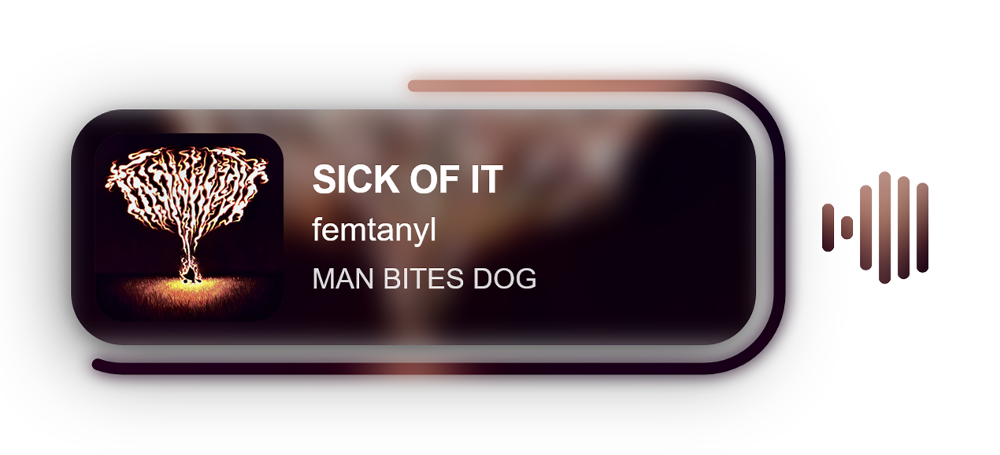

# Spotify OBS Widget

A real-time Spotify now-playing widget for OBS. Shows current track, album art, progress bar and animated equalizer (all without the Spotify API).



## Features

- **Track info** — title, artist, album art with smooth transitions
- **Progress bar** — smooth animated ring with album art texture
- **Equalizer** — 6-band real-time FFT visualizer (40Hz–20kHz)
- **No Spotify API** — reads track info via Windows Media Session (SMTC)
- **Tray app** — start/stop everything from the system tray, auto-starts with Windows

## Requirements

- Windows 10/11
- [Node.js](https://nodejs.org) 18+
- [Python](https://python.org/downloads) 3.10+ (add to PATH during install)
- OBS Studio
- [VB-Audio Virtual Cable](https://vb-audio.com/Cable/) *(optional, for equalizer)*

## Installation

```powershell
powershell -ExecutionPolicy Bypass -File install.ps1
```

The installer will:
1. Check Node.js and Python
2. Install npm and pip dependencies
3. Add the tray app to Windows startup
4. Guide you through VB-Audio setup (optional)

## Manual setup

```powershell
npm install
pip install pyaudiowpatch numpy websocket-client winrt-Windows.Media.Control winrt-Windows.Storage.Streams winrt-Windows.Foundation winrt-Windows.Foundation.Collections
```

## Usage

1. **Double-click** `run-tray.vbs` to start the tray app
2. **Right-click** the tray icon → **Start Widget**
3. In OBS: add **Browser Source** → `http://localhost:8765/widget` (width: 445, height: 175)
4. *(Optional)* Right-click tray → **Start Equalizer**

## Equalizer setup (VB-Audio)

The equalizer captures audio from a virtual audio cable to isolate Spotify's output:

1. Install [VB-Audio Virtual Cable](https://vb-audio.com/Cable/)
2. Volume mixer settings → set **CABLE Input** as default output device for Spotify
3. CABLE Output properties → **Listen** tab → enable **Listen to this device** → select your headphones
4. Right-click tray → **Select capture device** → choose **CABLE Input**
5. Right-click tray → **Start Equalizer**

## Project structure

```
spotify-obs-widget/
├── server.js          — WebSocket server, serves widget.html
├── widget.html        — OBS browser source
├── smtc_reader.py     — reads Spotify track info via Windows Media Session API
├── eq_capture.py      — captures audio via WASAPI loopback, sends FFT bands
├── widget-tray.ps1    — system tray manager
├── run-tray.vbs       — silent launcher (add to startup)
├── install.ps1        — automated installer
└── package.json
```

## How it works

```
Spotify ──► Windows Media Session API ──► smtc_reader.py ──┐
                                                            ├──► server.js ──► widget.html (OBS)
CABLE Input (audio) ──► eq_capture.py (FFT) ───────────────┘
```

## License

MIT
